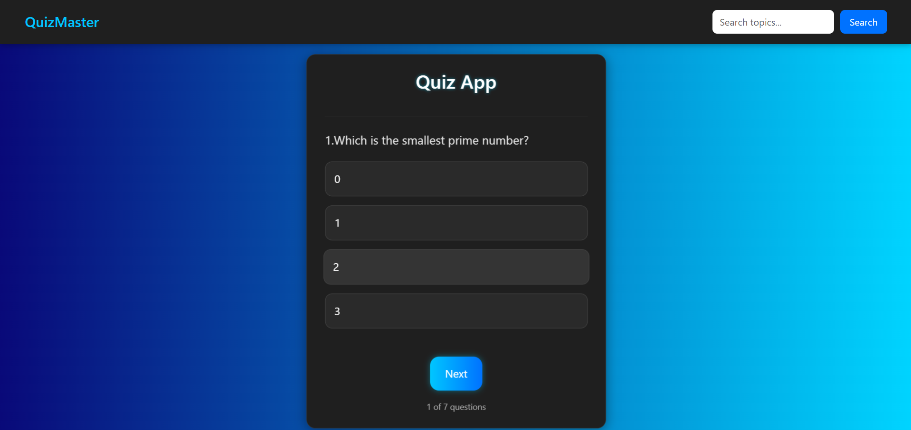

Absolutely, Ali. Here's a solid `README.md` tailored for your React Quiz App, with clean structure, professional tone, and a visual preview using your screenshot from `src/assets/quizapp`. You can copy this directly into your repo:

---

## 🧠 QuizMaster — React Quiz App

A sleek, responsive quiz application built with React. It features dynamic scoring, interactive answer validation, and a clean dark-themed UI. Perfect for frontend practice, portfolio demos, or deploying as a mini product.

---

### 📸 Preview

> 

---

### 🚀 Features

- ✅ Dynamic question rendering from custom data
- ✅ Real-time answer validation with correct/wrong highlights
- ✅ Score tracking and result display
- ✅ Responsive design with modern dark UI
- ✅ Clean component structure using React hooks and refs
- ✅ Styled with custom CSS (no external UI libraries)

---

### 🛠️ Tech Stack

- **React** (Functional Components + Hooks)
- **JavaScript**
- **Custom CSS**

---

